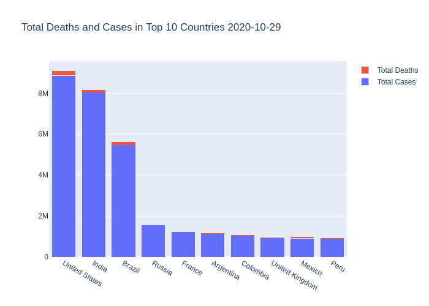

# COVID-19-Data-Analysis
An exploratory analysis of COVID-19 related statistics

## Data Source
COVID-19 dataset is a collection of the COVID-19 data maintained by Our World in Data. 
It is updated daily and includes data on confirmed cases, deaths, and testing.
source: https://github.com/owid/covid-19-data/tree/master/public/data/

For an interactive version of the plot click here: https://eispat28.github.io/COVID-19-Data-Analysis/bar_chart.html
